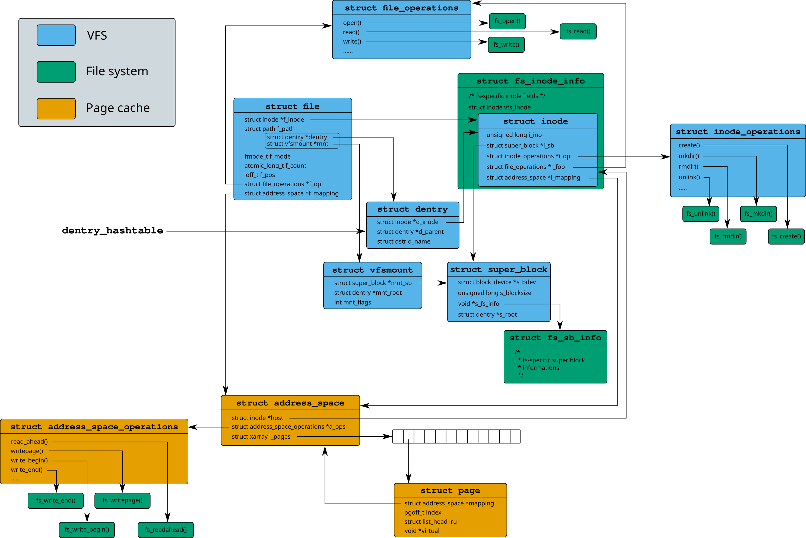

# ouiche_fs - a simple educational filesystem for Linux
The main objective of this project is to provide a simple Linux filesystem for students to build on.

## Summary
- [Usage](#Usage)
- [Design](#Design)
- [Roadmap](#Roadmap)

## Usage
### Building the kernel module
You can build the kernel module for your currently running kernel with `make`. If you wish to build the module against a different kernel, run `make KERNELDIR=<path>`. Insert the module with `insmod ouichefs.ko`.

This code was tested on a 6.5.7 kernel.

### Formatting a partition
First, build `mkfs.ouichefs` from the mkfs directory. Run `mkfs.ouichefs img` to format img as a ouiche_fs partition. For example, create a zeroed file of 50 MiB with `dd if=/dev/zero of=test.img bs=1M count=50` and run `mkfs.ouichefs test.img`. You can then mount this image on a system with the ouiche_fs kernel module installed.

## Design
This filesystem does not provide any fancy feature to ease understanding.

### Partition layout
    +------------+-------------+-------------------+-------------------+-------------+
    | superblock | inode store | inode free bitmap | block free bitmap | data blocks |
    +------------+-------------+-------------------+-------------------+-------------+
Each block is 4 KiB large.

### Superblock
The superblock is the first block of the partition (block 0). It contains the partition's metadata, such as the number of blocks, number of inodes, number of free inodes/blocks, ...

### Inode store
Contains all the inodes of the partition. The maximum number of inodes is equal to the number of blocks of the partition. Each inode contains 80B of data: standard data such as file size and number of used blocks, as well as a ouiche_fs-specific field called `index_block`. This block contains:
  - for a directory: the list of files in this directory. A directory can contain at most 128 files, and filenames are limited to 28 characters to fit in a single block.
  

  - for a file: the list of blocks containing the actual data of this file. Since block IDs are stored as 32-bit values, at most 1024 links fit in a single block, limiting the size of a file to 4 MiB.

### Inode and block free bitmaps
These two bitmaps track if inodes/blocks are used or not.

### Data blocks
The remainder of the partition is used to store actual data on disk.

### Data structure relations in the Linux kernel

## Roadmap
### Current features
#### Directories
- Creation and deletion
- List content
- Renaming

#### Regular files
- Creation and deletion
- Reading and writing (through the page cache)
- Renaming

### Future features
- Hard and symbolic link support
